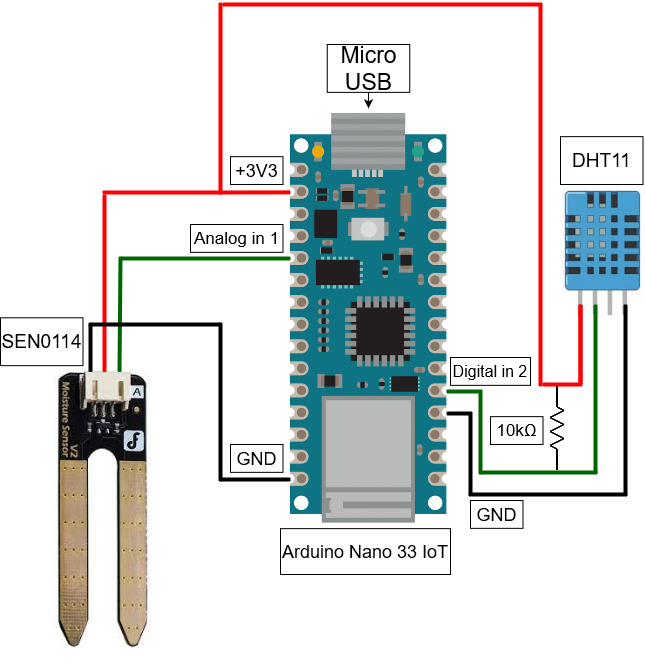

# plant-iot

## Components:

- Arduino Nano IoT 33
- Breadboard
- Jumper assembly
- Soil moisture meter - SEN0114
- Humidity/Temperature sensor - DHT11

## Connection diagram:

## System architecture

## Techonologies

### Device

- Arduino
- ArduinoMQTT
- ArduinoJSON

### Backend and database

- PostgreSQL
- TypeScript
- Socket.io
- Knex.js
- Heroku

### Dashboard

- React
- TypeScript
- TailwindCSS
- Socket.io
- Netlify

### MQTT-broker

- CloudMQTT
